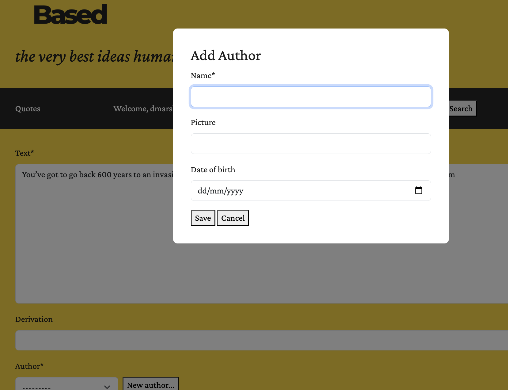
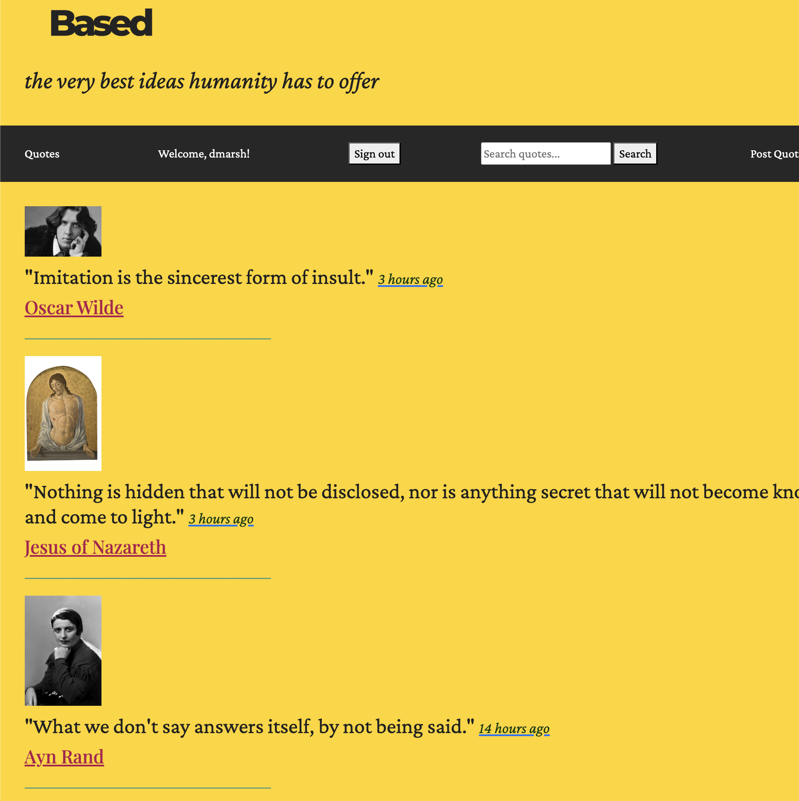
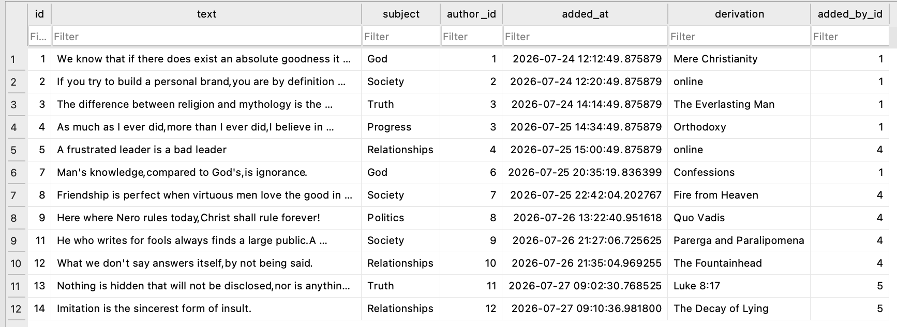
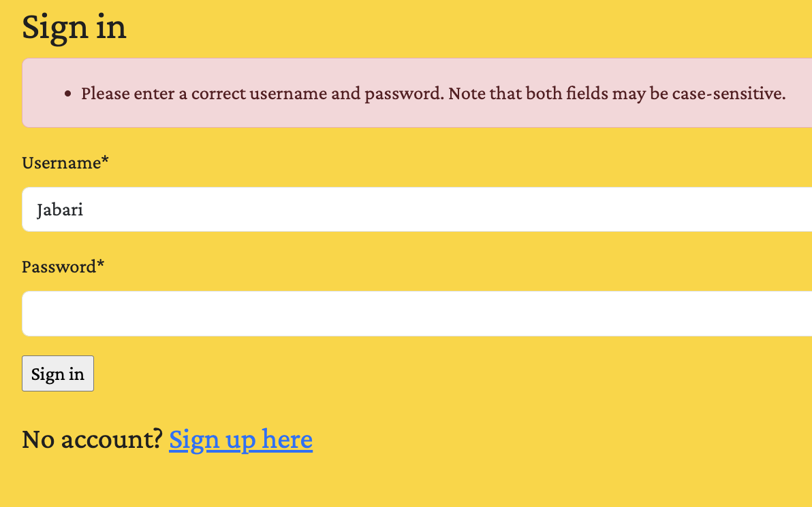
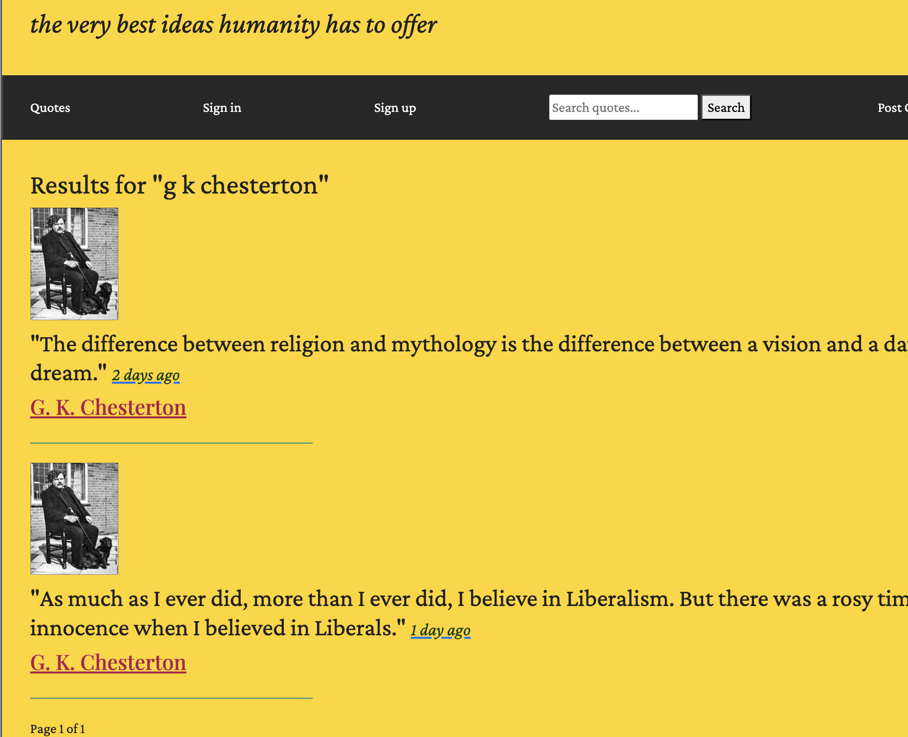

[Based](https://alanturing13.pythonanywhere.com/) is a Full-stack Knowledge Repository & Query Engine I built using Django ORM, currently deployed as a free web-service.

I wanted to build a content management system serving theological and philosophical quotes.

First I designed a normalised SQLite schema with multi-table relationships (`ForeignKey` linking Quotes, Authors and Categorised Subjects). 

For the Security pipeline, I implemented custom session-based Auth with protected view-level permissions (`LoginRequiredMixin`), so that only registered & signed-in users could post quotes, and only the user that created a post can edit or delete it. For user registration I automated SMTP token validation so that a valid email address would be required to create an account. To protect against malicious posts, a newly registered user's first quote has to be vetted by site admin before it goes live.

Entity attribution metadata such as `added_at` and `added_by` lends the service a social element. I have also implemented multi-attribute query filtering and paginated querysets to make the quote library more accessible. Users can search by content, author name, source and subject.

